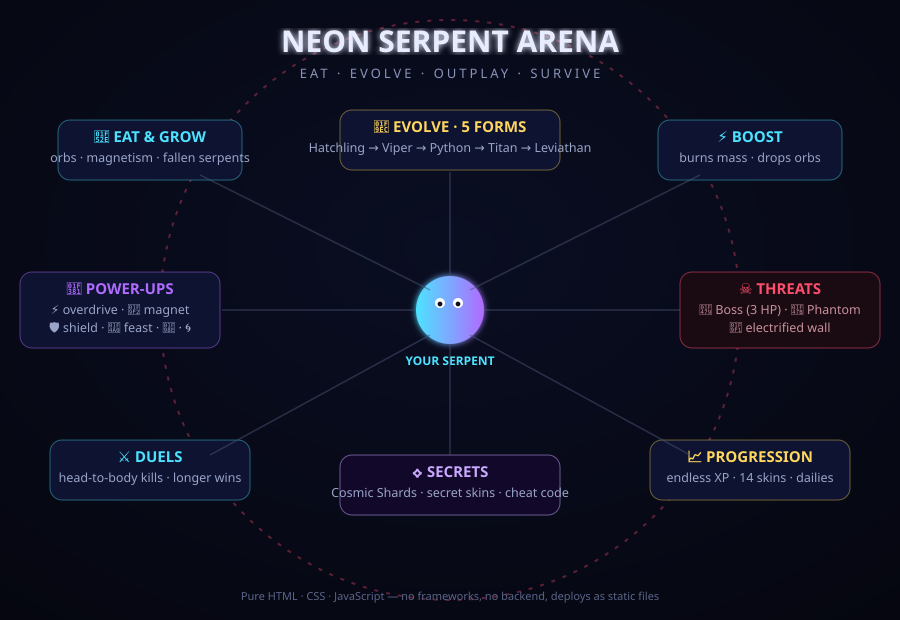
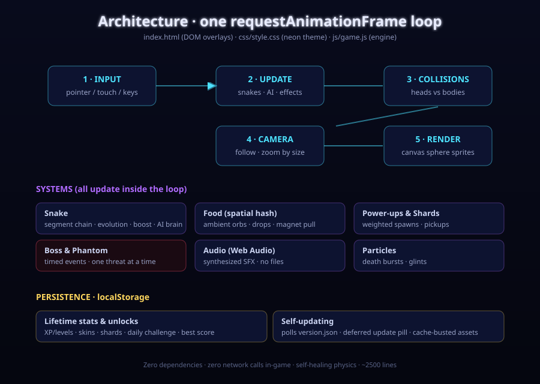

# 🐍 Neon Serpent Arena

**v1.7.0** — A fast, glossy-3D, slither-style snake arena game built with **pure HTML, CSS and JavaScript** — no frameworks, no build step, no dependencies. Eat orbs, dodge rival AI serpents, boost past them and climb the leaderboard.

Inspired by **snake.io** and **slither.io** — rebuilt from scratch with its own rules (see the in-game **About** screen for the full list of differences).



## How it's built

One `requestAnimationFrame` loop drives everything; all state lives in `js/game.js`, the HUD/overlays are plain DOM, and progress persists to `localStorage`.



## Play

**▶ Live: [neon-serpent-arena-game.vercel.app](https://neon-serpent-arena-game.vercel.app/)**

Or open `index.html` in any modern browser, or serve the folder:

```bash
npx serve .
```

## How to play

| Action | Control |
|--------|---------|
| Steer  | Move the mouse / drag on touch |
| Boost  | Hold left-click, **Space**, or the ⚡ button (mobile) |
| Pause  | **P**, **Esc**, or the ⏸ button (auto-pauses on tab switch) |
| Mute   | **M**, the 🔊 button, or the menu toggle |
| Grow   | Eat glowing orbs and the remains of fallen serpents |
| Die    | Crash into another serpent's body or the electrified arena wall |

Boosting is a trade-off: you move ~1.8× faster but burn mass, leaving a trail of orbs behind you that rivals can eat.

## Evolution

Your serpent evolves through 5 forms as it grows, each with a size jump, extra pace and a new look:

| Tier | At length | Look |
|------|-----------|------|
| Hatchling | 0 | — |
| Viper | 40 | ★ rank on name tag |
| Python | 110 | glowing head aura |
| Titan | 210 | fins along the body |
| Leviathan | 340 | golden crown of spikes |

## Power-ups

Glowing rings spawn around the arena — bots hunt them too:

| | Effect |
|---|--------|
| ⚡ Overdrive | boost speed for 6s, free (no mass drain) |
| 🧲 Magnet | 2.6× orb attraction range for 10s, with a visible field ring |
| 🛡️ Shield | cheat death once (crash or wall), then 2s of invulnerability |
| 💠 Feast | instant +20 length |
| 🦎 Chameleon | **rare** — re-colors your snake with the hue most distinct from every nearby serpent; the answer to unreadable same-color brawls |

## Skins, dailies & bosses (v1.3.0)

- **Glossy 3D rendering** — every body segment, head and orb is a pre-rendered specular sphere sprite with soft drop shadows
- **14-skin collection** — 6 free, 8 unlockable through achievements (total score, kills, games played, single-run score, reaching Leviathan, boss kills, daily challenges); locked skins show their unlock condition, and bots model the whole catalog in-game
- **Daily challenges** — a rotating goal each day (score / kills / orbs eaten) with a progress bar on the menu; completions count toward the Galaxy skin
- **Boss events** — every couple of minutes a 3-HP boss serpent (Omega Serpent, Void Wyrm, Inferno Naga, Storm Basilisk) invades and hunts you; trick it into your body three times to defeat it for a mass bonus and the Ember Lord skin
- **Crown on the leader** — the current #1 serpent wears a golden crown in the arena
- Kill-counter chip in the HUD; "Skin unlocked" toasts
- **Synthesized sound effects** (v1.4.0) — eat blips, boost whoosh, kills, death, evolution fanfare, boss horn/impacts/victory, unlock chimes — all generated with the Web Audio API, zero audio files; mute toggle in the HUD (🔊), menu, or press **M** (persisted)
- **Self-updating** (v1.3.1) — the game polls `version.json` and shows an "Update available — tap to refresh" pill when a new deploy lands; the menu version tag doubles as a manual update check
- **👁 Ghost mode** (v1.5.0) — spectate the arena without playing: the camera follows the current leader while bots, bosses and phantoms battle on
- **👻 The Phantom** (v1.5.0) — a spectral serpent that haunts the arena for ~25s at a time; it can't be killed and bodies pass through it, but its touch drains your length — pure avoidance tension (never spawns at the same time as a boss)
- Bigger orbs are now worth more (value scales with dot size)
- **⏸ Pause** (v1.7.0) — P / Esc / HUD button, with auto-pause when the tab loses focus; shows a strategy tip while paused
- **Arena intensity** (v1.7.0) — user-selectable Chill / Classic / Chaos: bot count (8/13/18), starting sizes and boss/phantom cadence
- **Endless levels** (v1.7.0) — lifetime XP (all score ever earned) drives an uncapped level curve with titles and an XP bar; level-up toasts on the death screen
- **Endless difficulty ramp** (v1.7.0) — respawning bots return bigger as your run's score climbs, so long runs stay dangerous
- **FX Full/Lite toggle** (v1.7.0) — Lite skips shadows, glows and stars for smooth play on older phones
- **🦎 Chameleon** (v1.6.0) — see power-ups table
- **Safe updates** (v1.5.3) — update prompts never interrupt a live run; accidental refresh asks for confirmation
- **✨ Spawn ghost** (v1.8.0) — every snake (you, bots, even the boss) spawns intangible for 3 seconds: it can't die and nobody can die on its body; flickers while active, with a ✨ countdown chip
- **Tablet UI** (v1.7.2) — large touch screens get scaled-up menus, HUD and touch targets

## Features

- Circular neon arena with an electrified boundary ring
- 5-tier evolution system with visual forms and an "EVOLVED" banner
- Power-up rings (overdrive, magnet, shield, feast) contested by the AI
- 13 AI serpents with food-seeking, wall-avoidance and body-dodging behavior
- Boost mechanic that drains mass and drops orbs
- Head-to-head duels — the bigger serpent wins
- Dead serpents burst into a feast of glowing orbs
- Live leaderboard, minimap, score panel and personal-best tracking (localStorage)
- 6 selectable glow skins and a persistent nickname
- Orb magnetism, camera zoom that scales with your size, death-burst particles
- Full touch support with an on-screen boost button
- Animated menu background with idle serpents roaming the arena
- **Sharing** — generate a neon share card (score + run chart + frozen final frame) via the Web Share API, with download/clipboard fallback; in-game 📸 screenshot button with watermark; "Share game" invite link
- **Run chart** — score-over-time graph on the death screen and share card
- **In-game tutorial** — 8-step "How to play" overlay covering movement, boosting, combat, power-ups, evolution and tactics
- **About screen** — credits the snake.io / slither.io inspiration and lists exactly what's different
- Version tag, mid-run restart button (⟳), and a "Reset progress" option

## Deploy to Vercel

This is a fully static site — Vercel needs zero configuration.

```bash
npm i -g vercel
vercel deploy --prod
```

Or push the repo to GitHub and import it at [vercel.com/new](https://vercel.com/new) — select **Other** as the framework preset (no build command, output directory `.`).

## Project structure

```
├── index.html      # markup: canvas, HUD, menu and death overlays
├── css/style.css   # neon UI theme
├── js/game.js      # engine: world, snakes, AI, food, rendering, input
└── vercel.json     # static hosting headers
```
