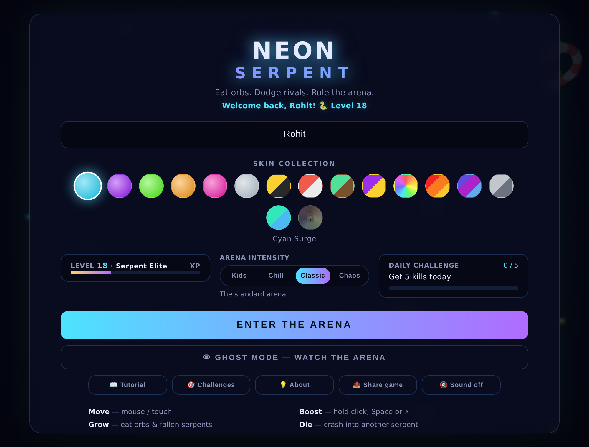
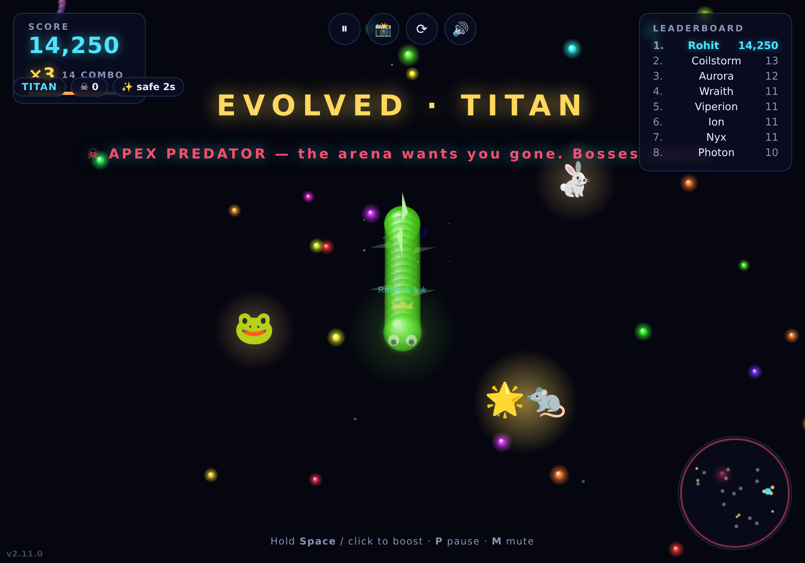
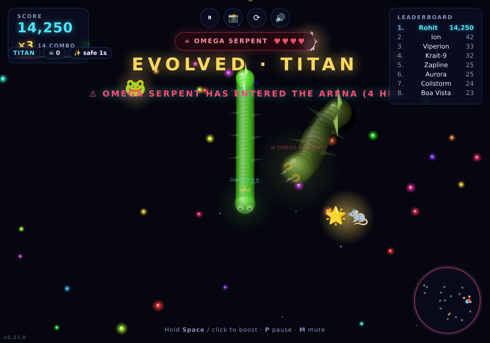

# 🐍 Neon Serpent Arena

**v2.14.1** — A fast, glossy-3D, slither-style snake arena game built with **pure HTML, CSS and JavaScript** — no frameworks, no build step, no dependencies. Eat orbs, chase fleeing prey, dodge rival AI serpents, build a combo multiplier, climb the leaderboard and rise through the rank ladder.

Inspired by **snake.io** and **slither.io** — rebuilt from scratch with its own rules (see the in-game **About** screen for the full list of differences).


## Our goal

Make a game that's genuinely **fun to play** — instantly pick-up-and-go for a kid, with enough depth to keep you chasing "one more run." Two rules guide every change:

- **Skill first, no pay-to-win.** Everything is earned by playing; skins are cosmetic. The moment-to-moment loop (combos, catches, near-misses) is the reward.
- **Polish over piling on.** This game is feature-rich, so we favour making what's there *feel great* — juice, balance, catchability, readability — over bolting on new systems. (We've removed features that fought the core skill.)

## Screenshots

<p align="center">
  
  
</p>
<p align="center">
  
</p>

<p align="center"><em>Menu · gameplay with the combo multiplier and running prey · the green-anaconda boss</em></p>

## How it's built

One `requestAnimationFrame` loop drives everything; all state lives in `js/game.js`, the HUD/overlays are plain DOM, and progress persists to `localStorage`.


## Play

**▶ Live: [neon-serpent-arena-game.vercel.app](https://neon-serpent-arena-game.vercel.app/)**

Or open `index.html` in any modern browser, or serve the folder:

```bash
npx serve .
```

## How to play

| Action | Control |
|--------|---------|
| Steer  | Move the mouse / drag on touch |
| Boost  | Hold left-click, **Space**, or the ⚡ button (mobile) |
| Pause  | **P**, **Esc**, or the ⏸ button (auto-pauses on tab switch) |
| Mute   | **M**, the 🔊 button, or the menu toggle |
| Grow   | Eat glowing orbs and the remains of fallen serpents |
| Combo  | Eat / catch / kill in quick succession to build a **×1 → ×5 score multiplier** |
| Hunt   | Chase the fleeing 🐀 prey and catch them for a bonus (boost helps, or wait for them to tire) |
| Die    | Crash into another serpent's body or the electrified arena wall |

Boosting is a trade-off: you move ~1.8× faster but burn mass, leaving a trail of orbs behind you that rivals can eat.

## Evolution

Your serpent evolves through 5 forms as it grows, each with a size jump, extra pace and a new look:

| Tier | At length | Look |
|------|-----------|------|
| Hatchling | 0 | — |
| Viper | 40 | ★ rank on name tag |
| Python | 110 | glowing head aura |
| Titan | 210 | fins along the body |
| Leviathan | 340 | golden crown of spikes |

## Power-ups

Glowing rings spawn around the arena — bots hunt them too:

| | Effect |
|---|--------|
| ⚡ Overdrive | boost speed for 6s, free (no mass drain) |
| 🧲 Magnet | 2.6× orb attraction range for 10s, with a visible field ring |
| 🛡️ Shield | cheat death once (crash or wall), then 2s of invulnerability |
| 💠 Feast | instant +20 length |
| 🦎 Chameleon | **rare** — re-colors your snake with the hue most distinct from every nearby serpent; the answer to unreadable same-color brawls |
| 👿 Soul Swap | **rare** — steal the *size* of the biggest snake near you (they shrink, you grow; your score stays yours). Bots that grab it only grow a little, so they can't steal from you |

Plus a very rare **⟡ Cosmic Shard** that drifts through the arena — collect them across runs to unlock secret skins.

## Combos, prey & the late game

The pieces that keep a run moreish once you've grown big:

- **🏆 Rank / tier ladder** (v2.14) — your **best run ever** places you on a persistent ladder: **Bronze → Silver → Gold → Platinum → Diamond → Master**, each split into three divisions (III → II → I). A neon rank badge on the menu shows your tier, division and a progress bar to the next step; the death screen celebrates a **RANK UP!** the moment a run promotes you. Pure skill — driven only by your best score, entirely client-side (no account, no server, no pay-to-win).
- **Combo & multiplier** (v2.10) — eating orbs, catching prey and killing rivals in quick succession builds a **combo** and a rising **score multiplier (×1 → ×5)**, shown as a glowing HUD chip with a decay bar. Let it lapse (~2.6s without feeding) and it resets. Hit **🔥 ON FIRE** at ×4. Your best combo is a death-screen stat.
- **Running prey** (v2.9) — live critters scurry in and **flee** the nearest serpent: 🐀 rat · 🐸 frog · 🐤 chick · 🐹 hamster · 🐇 rabbit · 🦎 lizard · 🐛 grub · 🐰 bunny, plus a rare **🌟 golden rat jackpot**. Bigger/faster ones pay more. They sprint but **tire**, so a plain chase (or a boost) reels them in — extra gentle in Kid Mode. They ping the minimap.
- **🐍✨ Nagin event** (v2.13) — a rare, magical serpent from folklore glides through the arena to a synthesized **been / pungi** melody, trailing golden blessing-orbs. Touch it for the Nagin's blessing (fortune + overdrive) and the **Naga** skin. Public-domain mythology — no licensed brands.
- **Late-game escalation** (v2.7) — as your score climbs, "heat" rises: bosses grow tougher (3 → 6 HP) and longer, bosses and the phantom spawn more often, and rivals respawn bigger. Milestone warnings fire at 5K / 10K / 20K, so dominating never gets dull.
- **Juice** (v2.11) — floating **"+score" popups**, a **screen-shake** kick on kills / boss arrivals / big catches / death, and synthesized **snake hiss** & prey chirps — all FX respect the **FX: Lite** toggle.

## Skins, dailies & bosses (v1.3.0)

- **Glossy 3D rendering** — every body segment, head and orb is a pre-rendered specular sphere sprite with soft drop shadows
- **18-skin collection** — 6 free, 12 unlockable through achievements (total score, kills, games played, single-run score, reaching Leviathan, boss kills, daily challenges, the Challenges ladder, and the Nagin's blessing); locked skins show their unlock condition, and bots model the whole catalog in-game
- **Daily challenges** — a rotating goal each day (score / kills / orbs eaten) with a progress bar on the menu; completions count toward the Galaxy skin
- **Challenges ladder** (v2.8.0) — 12 permanent one-run goals (reach length 150/300, score 3K/10K/25K, 3/8 kills, slay 1/2 bosses, survive 3 min, reach Leviathan, 5K in Chaos), opened from the 🎯 menu button; complete 6 for the **Vanguard** skin and all 12 for **Champion** 👑
- **Boss events** — every couple of minutes a boss serpent (Omega Serpent, Void Wyrm, Inferno Naga, Storm Basilisk) invades and hunts you; trick it into your body to defeat it for a mass bonus and the Ember Lord skin. Bosses now wear a **green-anaconda** look (mottled body, amber slit eyes, fangs) and scale from **3 to 6 HP** with your score. Every serpent also flicks a **forked tongue** and tapers to a **pointed python tail**.
- **Crown on the leader** — the current #1 serpent wears a golden crown in the arena
- Kill-counter chip in the HUD; "Skin unlocked" toasts
- **Kill-opportunity cue** (v2.3.0) — a rival head about to crash into your body gets a pulsing red ring, so you can spot the moment to cut it off (only head-to-body kills; bodies crossing is harmless)
- **Update on return** (v2.3.0) — a tab left backgrounded for hours offers the update right on the pause screen it returns to
- **Synthesized sound effects** (v1.4.0) — eat blips, boost whoosh, kills, death, evolution fanfare, boss horn/impacts/victory, unlock chimes — all generated with the Web Audio API, zero audio files; mute toggle in the HUD (🔊), menu, or press **M** (persisted)
- **Self-updating** (v1.3.1) — the game polls `version.json` and shows an "Update available — tap to refresh" pill when a new deploy lands; the menu version tag doubles as a manual update check
- **👁 Ghost mode** (v1.5.0) — spectate the arena without playing: the camera follows the current leader while bots, bosses and phantoms battle on
- **👻 The Phantom** (v1.5.0) — a spectral serpent that haunts the arena for ~25s at a time; it can't be killed and bodies pass through it, but its touch drains your length — pure avoidance tension (never spawns at the same time as a boss)
- Bigger orbs are now worth more (value scales with dot size)
- **⏸ Pause** (v1.7.0) — P / Esc / HUD button, with auto-pause when the tab loses focus; shows a strategy tip while paused
- **Arena intensity** (v1.7.0) — user-selectable Chill / Classic / Chaos: bot count (8/13/18), starting sizes and boss/phantom cadence
- **Endless levels** (v1.7.0) — lifetime XP (all score ever earned) drives an uncapped level curve with titles and an XP bar; level-up toasts on the death screen
- **Endless difficulty ramp** (v1.7.0) — respawning bots return bigger as your run's score climbs, so long runs stay dangerous
- **FX Full/Lite toggle** (v1.7.0) — Lite skips shadows, glows and stars for smooth play on older phones
- **🦎 Chameleon** (v1.6.0) — see power-ups table
- **Safe updates** (v1.5.3) — update prompts never interrupt a live run; accidental refresh asks for confirmation
- **✨ Spawn ghost** (v1.8.0) — every snake (you, bots, even the boss) spawns intangible for 3 seconds: it can't die and nobody can die on its body; flickers while active, with a ✨ countdown chip
- **Tablet UI** (v1.7.2) — large touch screens get scaled-up menus, HUD and touch targets

## Features

- Circular neon arena with an electrified boundary ring
- 5-tier evolution system with visual forms and an "EVOLVED" banner
- Power-up rings (overdrive, magnet, shield, feast, chameleon, soul-swap) contested by the AI
- 6–18 AI serpents (by arena intensity) with food-seeking, wall-avoidance and body-dodging behavior
- Boost mechanic that drains mass and drops orbs
- Combo & score multiplier (×1 → ×5) with floating "+score" popups and screen shake
- Running prey (a fleeing-critter bestiary) you chase and catch for bonuses
- Head-to-head duels — the bigger serpent wins
- Dead serpents burst into a feast of glowing orbs
- Live leaderboard, minimap, score panel and personal-best tracking (localStorage)
- 6 selectable glow skins and a persistent nickname
- Orb magnetism, camera zoom that scales with your size, death-burst particles
- Full touch support with an on-screen boost button
- Animated menu background with idle serpents roaming the arena
- **Sharing** — generate a neon share card (score + run chart + frozen final frame) via the Web Share API, with download/clipboard fallback; in-game 📸 screenshot button with watermark; "Share game" invite link
- **Run chart** — score-over-time graph on the death screen and share card
- **In-game tutorial** — 8-step "How to play" overlay covering movement, boosting, combat, power-ups, evolution and tactics
- **About screen** — credits the snake.io / slither.io inspiration and lists exactly what's different
- Version tag, mid-run restart button (⟳), and a "Reset progress" option

## Arena intensity (v2.4.0)

Pick your pace on the menu — the difference is immediate:

| Mode | Rivals | Threats | Speed |
|------|--------|---------|-------|
| **Kids** | 6 small | none (no bosses/phantom) | slower, easier to control |
| **Chill** | 8 smaller | rare bosses | normal |
| **Classic** | 13 | standard | normal |
| **Chaos** | 18 bigger | frequent bosses | normal |

**Kid Mode** removes every scary/hard element (no bosses, no phantom) and slows the game down so young players can enjoy it. The UI also scales up on tablets for big, easy touch targets.

## Roadmap

- **Real multiplayer** — two friends in the same live arena. This needs a game server (authoritative state + WebSocket sync), so it's a separate backend project rather than a change to this static client. Logged as a future TODO.

## Deploy to Vercel

This is a fully static site — Vercel needs zero configuration.

```bash
npm i -g vercel
vercel deploy --prod
```

Or push the repo to GitHub and import it at [vercel.com/new](https://vercel.com/new) — select **Other** as the framework preset (no build command, output directory `.`).

## Project structure

```
├── index.html      # markup: canvas, HUD, menu and death overlays
├── css/style.css   # neon UI theme
├── js/game.js      # engine: world, snakes, AI, food, rendering, input
└── vercel.json     # static hosting headers
```
